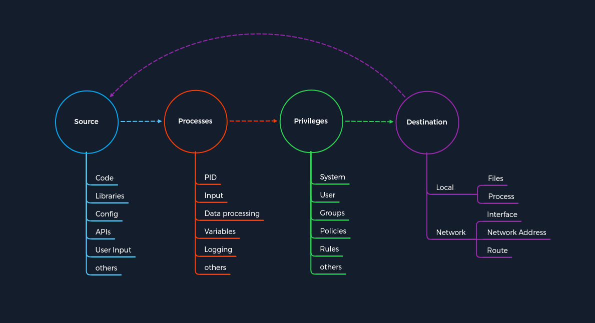

# Le concept d'attaques
Pour comprendre efficacement les attaques sur les différents services, nous devons examiner comment ces services peuvent être attaqués. Un concept est un plan décrit qui est appliqué aux projets futurs. A titre d'exemple, on peut penser au concept de construction d'une maison. De nombreuses maisons ont un sous-sol, quatre murs et un toit. La plupart des maisons sont construites de cette façon, et c'est un concept qui est appliqué partout dans le monde. Les détails les plus fins, tels que le matériau utilisé ou le type de conception, sont flexibles et peuvent être adaptés aux souhaits et aux circonstances individuels. Cet exemple montre qu'un concept nécessite une catégorisation générale (sol, murs, toit).

Dans notre cas, nous devons créer un concept pour les attaques sur tous les services possibles et le diviser en catégories qui résument tous les services mais laissent les méthodes d'attaque individuelles.

Pour expliquer un peu plus clairement de quoi nous parlons ici, nous pouvons essayer de regrouper nous-mêmes les services SSH, FTP, SMB et HTTP et de comprendre ce que ces services ont en commun. Ensuite, nous devons créer une structure qui nous permettra d'identifier les points d'attaque de ces différents services à l'aide d'un modèle unique.

L'analyse des points communs et la création de modèles de modèles qui correspondent à tous les cas imaginables ne sont pas un produit fini, mais plutôt un processus qui rend ces modèles de modèles de plus en plus grands. Par conséquent, nous avons créé un modèle de modèle pour ce sujet afin que vous puissiez enseigner et expliquer mieux et plus efficacement le concept derrière les attaques.

Le concept est basé sur quatre catégories qui se produisent pour chaque vulnérabilité. Tout d'abord, nous avons une source qui exécute la demande spécifique à un processus où la vulnérabilité est déclenchée. Chaque processus a un ensemble spécifique de privilèges avec lesquels il est exécuté. Chaque processus a une tâche avec un objectif ou une destination spécifique pour calculer de nouvelles données ou les transmettre. Cependant, les spécifications individuelles et uniques de ces catégories peuvent différer d'un service à l'autre.

Chaque tâche et chaque information suit un schéma spécifique, un cycle, que nous avons délibérément rendu linéaire. En effet, la destination ne sert pas toujours de source et n'est donc pas traitée comme une source d'une nouvelle tâche.

Pour qu'une tâche puisse voir le jour, elle a besoin d'une idée, d'informations (Source), d'un processus planifié (Processus) et d'un objectif spécifique (Destination) à atteindre. Par conséquent, la catégorie des privilèges est nécessaire pour contrôler les informations;

## Source
Nous pouvons généraliser Source comme une source d'informations utilisée pour la tâche spécifique d'un processus. Il existe de nombreuses façons de transmettre des informations à un processus. Le graphique montre certains des exemples les plus courants de la façon dont les informations sont transmises aux processus.

| Source d'informations | Descriptif |
| --- | --- |
| `Code` | Cela signifie que les résultats du code de programme déjà exécuté sont utilisés comme source d'informations. Ceux-ci peuvent provenir de différentes fonctions d'un programme. |
| `Bibliothèques` | Une bibliothèque est un ensemble de ressources de programme, notamment des données de configuration, de la documentation, des données d'aide, des modèles de message, du code et des sous-programmes prédéfinis, des classes, des valeurs ou des spécifications de type. |
| `Configuration` | Les configurations sont généralement des valeurs statiques ou prescrites qui déterminent la manière dont le processus traite les informations. |
| `API` | L'interface de programmation d'application (API) est principalement utilisée comme interface de programmes pour récupérer ou fournir des informations. |
| `Entrée utilisateur` | Si un programme a une fonction qui permet à l'utilisateur de saisir des valeurs spécifiques utilisées pour traiter les informations en conséquence, il s'agit de la saisie manuelle des informations par une personne. |

La source est donc la source qui est exploitée pour les vulnérabilités. Peu importe le protocole utilisé car les injections d'en-tête HTTP peuvent être manipulées manuellement, tout comme les débordements de tampon. La source de cela peut donc être classée dans la catégorie Code. Examinons donc de plus près le modèle de modèle basé sur l'une des dernières vulnérabilités critiques dont la plupart d'entre nous ont entendu parler.

### Log4j
Un bon exemple est la vulnérabilité critique Log4j (CVE-2021-44228) qui a été publiée fin 2021. Log4j est un framework ou une bibliothèque utilisée pour enregistrer les messages d'application en Java et dans d'autres langages de programmation. Cette bibliothèque contient des classes et des fonctions que d'autres langages de programmation peuvent intégrer. A cet effet, les informations sont documentées, à l'instar d'un journal de bord. De plus, l'étendue de la documentation peut être configurée de manière extensive. En conséquence, il est devenu un standard dans de nombreux produits logiciels open source et commerciaux. Dans cet exemple, un attaquant peut manipuler l'en-tête HTTP User-Agent et insérer une recherche JNDI en tant que commande destinée à la bibliothèque Log4j. En conséquence, ce n'est pas l'en-tête User-Agent réel, tel que Mozilla 5.0, qui est traité, mais la recherche JNDI.

## Processus
Le processus consiste à traiter les informations transmises par la source. Ceux-ci sont traités en fonction de la tâche prévue déterminée par le code du programme. Pour chaque tâche, le développeur précise comment les informations sont traitées. Cela peut se produire en utilisant des classes avec différentes fonctions, calculs et boucles. La variété des possibilités pour cela est aussi variée que le nombre de développeurs dans le monde. En conséquence, la plupart des vulnérabilités résident dans le code du programme exécuté par le processus.

| Composants de processus | Descriptif |
| --- | --- |
| `PID` | Le Process-ID (PID) identifie le processus en cours de démarrage ou déjà en cours d'exécution. Les processus en cours d'exécution ont déjà des privilèges attribués et de nouveaux sont démarrés en conséquence. |
| `Entrée` | Il s'agit de la saisie d'informations pouvant être attribuées par un utilisateur ou résultant d'une fonction programmée. |
| `Traitement des données` | Les fonctions codées en dur d'un programme dictent la manière dont les informations reçues sont traitées. |
| `Variables` | Les variables sont utilisées comme espaces réservés pour les informations que différentes fonctions peuvent traiter ultérieurement au cours de la tâche. |
| `Journalisation` | Lors de la journalisation, certains événements sont documentés et, dans la plupart des cas, stockés dans un registre ou un fichier. Cela signifie que certaines informations restent dans le système.

  |

### Log4j
Le processus de Log4j consiste à enregistrer l'agent utilisateur sous forme de chaîne à l'aide d'une fonction et à le stocker à l'emplacement désigné. La vulnérabilité de ce processus est la mauvaise interprétation de la chaîne, qui conduit à l'exécution d'une requête au lieu d'enregistrer les événements. Cependant, avant d'aller plus loin dans cette fonction, nous devons parler de privilèges.

### Privilèges
Les privilèges sont présents dans tout système qui contrôle les processus. Ceux-ci servent de type d'autorisation qui détermine quelles tâches et actions peuvent être effectuées sur le système. En termes simples, cela peut être comparé à un ticket de bus. Si nous utilisons un ticket destiné à une région en particulier, nous pourrons utiliser le bus, et sinon, nous ne le pourrons pas. Ces privilèges (ou au sens figuré, nos billets) peuvent également être utilisés pour différents moyens de transport, tels que les avions, les trains, les bateaux et autres. Dans les systèmes informatiques, ces privilèges servent de contrôle et de segmentation des actions pour lesquelles différentes autorisations, contrôlées par le système, sont nécessaires. Par conséquent, les droits sont vérifiés en fonction de cette catégorisation lorsqu'un processus doit accomplir sa tâche. Si le processus satisfait à ces privilèges et conditions, le système approuve l'action demandée. Nous pouvons répartir ces privilèges dans les domaines suivants :

| Privilèges | Descriptif |
| --- | --- |
| `Système` | Ces privilèges sont les privilèges les plus élevés qui peuvent être obtenus, qui permettent toute modification du système. Sous Windows, ce type de privilège s'appelle `SYSTEM` et sous Linux, il s'appelle `root`. |
| `Utilisateur` | Les privilèges d'utilisateur sont des autorisations qui ont été attribuées à un utilisateur spécifique. Pour des raisons de sécurité, des utilisateurs distincts sont souvent configurés pour des services particuliers lors de l'installation des distributions Linux. |
| `Groupes` | Les groupes sont une catégorisation d'au moins un utilisateur qui dispose de certaines autorisations pour effectuer des actions spécifiques. |
| `Politiques` | Les stratégies déterminent l'exécution de commandes spécifiques à l'application, qui peuvent également s'appliquer à des utilisateurs individuels ou groupés et à leurs actions. |
| `Règles` | Les règles sont les autorisations d'effectuer des actions gérées à partir des applications elles-mêmes.

  |

### Log4j
Ce qui a rendu la vulnérabilité Log4j si dangereuse, ce sont les privilèges que l'implémentation a apportés. Les journaux sont souvent considérés comme sensibles car ils peuvent contenir des données sur le service, le système lui-même ou même les clients. Par conséquent, les journaux sont généralement stockés dans des emplacements auxquels aucun utilisateur régulier ne devrait pouvoir accéder. En conséquence, la plupart des applications avec l'implémentation Log4j étaient exécutées avec les privilèges d'un administrateur. Le processus lui-même a exploité la bibliothèque en manipulant l'agent utilisateur afin que le processus interprète mal la source et conduise à l'exécution de code fourni par l'utilisateur.

## Destination
Chaque tâche a au moins un but et un objectif qui doivent être remplis. Logiquement, si des modifications d'ensembles de données manquaient ou n'étaient stockées ou transmises nulle part, la tâche serait généralement inutile. Le résultat d'une telle tâche est soit stocké quelque part, soit transmis à un autre point de traitement. On parle donc ici de la Destination où les changements seront effectués. Ces points de traitement peuvent pointer vers un processus local ou distant. Par conséquent, au niveau local, les fichiers ou enregistrements locaux peuvent être modifiés par le processus ou être transmis à d'autres services locaux pour une utilisation ultérieure. Cependant, cela n'exclut pas la possibilité que le même processus puisse également réutiliser les données résultantes. Si le processus se termine par le stockage des données ou leur transmission, le cycle menant à l'achèvement de la tâche est fermé.

| destination | Descriptif |
| --- | --- |
| `Local` | La zone locale est l'environnement du système dans lequel le processus s'est déroulé. Par conséquent, les résultats et les résultats d'une tâche sont soit traités ultérieurement par un processus qui inclut des modifications des ensembles de données ou le stockage des données. |
| `Réseau` | La zone réseau consiste principalement à transmettre les résultats d'un processus à une interface distante. Cela peut être une adresse IP et ses services ou même des réseaux entiers. Les résultats de ces processus peuvent également influencer l'itinéraire dans certaines circonstances. |

### Log4j
La mauvaise interprétation du User-Agent conduit à une recherche JNDI qui est exécutée comme une commande du système avec des privilèges d'administrateur et interroge un serveur distant contrôlé par l'attaquant, qui dans notre cas est la destination dans notre concept d'attaques. Cette requête demande une classe Java créée par l'attaquant et est manipulée à ses propres fins. Le code Java interrogé à l'intérieur de la classe Java manipulée est exécuté dans le même processus, ce qui entraîne une vulnérabilité d'exécution de code à distance (RCE).

GovCERT.ch a créé une excellente représentation graphique de la vulnérabilité Log4j qui mérite d'être examinée en détail.

### Lancement de l'attaque
| Étape | Log4j | Concept d'attaques - Catégorie |
| --- | --- | --- |
| `1.` | L'attaquant manipule l'agent utilisateur avec une commande de recherche JNDI. | `Source` |
| `2.` | Le processus interprète mal l'agent utilisateur attribué, ce qui conduit à l'exécution de la commande. | `Processus` |
| `3.` | La commande de recherche JNDI est exécutée avec des privilèges d'administrateur en raison des autorisations de journalisation. | `Privilèges` |
| `4.` | Cette commande de recherche JNDI pointe vers le serveur créé et préparé par l'attaquant, qui contient une classe Java malveillante contenant des commandes conçues par l'attaquant. | `Destination` |

### Déclencher l'exécution du code à distance
| Étape | Log4j | Concept d'attaques - Catégorie |
| --- | --- | --- |
| `5.` | Une fois la classe Java malveillante extraite du serveur de l'attaquant, elle est utilisée comme source pour d'autres actions dans le processus suivant. | `Source` |
| `6.` | Ensuite, le code malveillant de la classe Java est lu, ce qui, dans de nombreux cas, a conduit à un accès à distance au système. | `Processus` |
| `7.` | Le code malveillant est exécuté avec des privilèges d'administrateur en raison des autorisations de journalisation. | `Privilèges` |
| `8.` | Le code renvoie sur le réseau à l'attaquant avec les fonctions qui permettent à l'attaquant de contrôler le système à distance. | `Destination` |

Enfin, nous voyons un modèle que nous pouvons utiliser à plusieurs reprises pour nos attaques. Ce modèle de modèle peut être utilisé pour analyser et comprendre les exploits et déboguer nos propres exploits pendant le développement et les tests. De plus, ce modèle de modèle peut également être appliqué à l'analyse du code source, ce qui nous permet de vérifier certaines fonctionnalités et commandes de notre code étape par étape. Enfin, nous pouvons également penser catégoriquement aux dangers de chaque tâche individuellement.