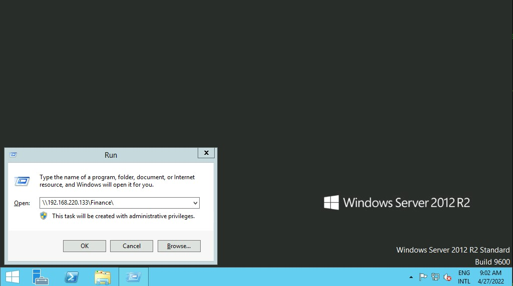
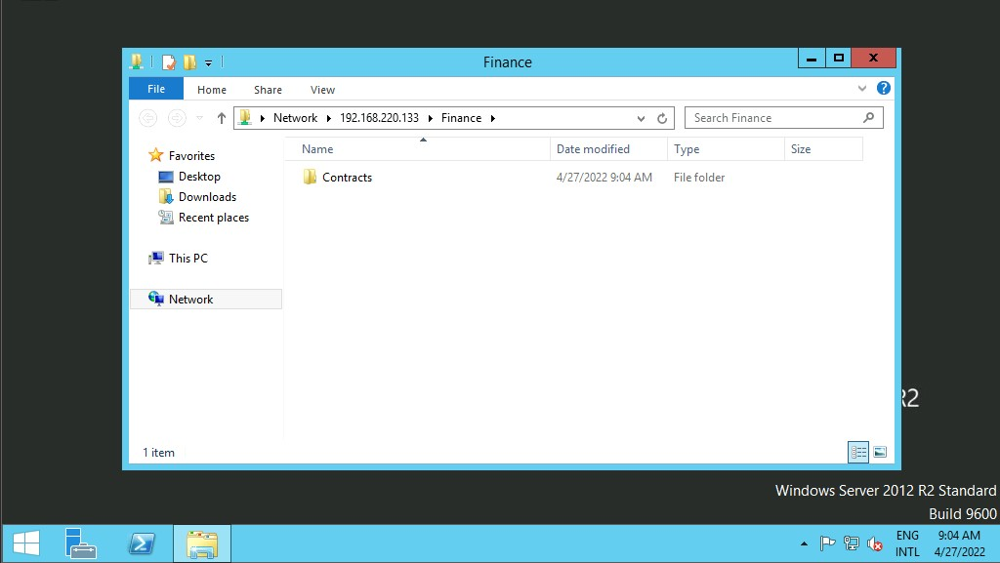
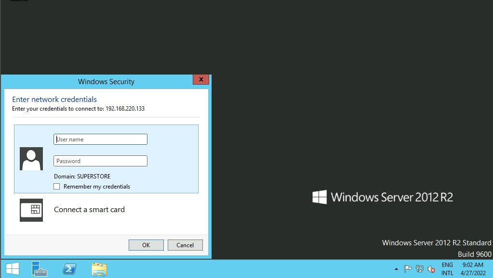

# Interaction avec les services communs


Les vulnérabilités sont généralement découvertes par des personnes qui utilisent et comprennent la technologie, un protocole ou un service. Au fur et à mesure que nous évoluerons dans ce domaine, nous trouverons différents services avec lesquels interagir, et nous devrons constamment évoluer et apprendre de nouvelles technologies.

Pour réussir à attaquer un service, nous devons connaître son objectif, comment interagir avec lui, quels outils nous pouvons utiliser et ce que nous pouvons en faire. Cette section se concentrera sur les services communs et sur la façon dont nous pouvons interagir avec eux.

## Services de partage de fichiers
Un service de partage de fichiers est un type de service qui fournit, assure la médiation et surveille le transfert de fichiers informatiques. Il y a des années, les entreprises n'utilisaient généralement que des services internes pour le partage de fichiers, tels que SMB, NFS, FTP, TFTP, SFTP, mais à mesure que l'adoption du cloud se développe, la plupart des entreprises disposent désormais également de services cloud tiers tels que Dropbox, Google Drive, OneDrive, SharePoint ou d'autres formes de stockage de fichiers telles qu'AWS S3, Azure Blob Storage ou Google Cloud Storage. Nous serons exposés à un mélange de services de partage de fichiers internes et externes, et nous devons nous familiariser avec eux.

Cette section se concentrera sur les services internes, mais cela peut s'appliquer au stockage en nuage synchronisé localement avec les serveurs et les postes de travail.

## Bloc de messages serveur (SMB)
SMB est couramment utilisé dans les réseaux Windows, et nous trouverons souvent des dossiers de partage dans un réseau Windows. Nous pouvons interagir avec SMB à l'aide de l'interface graphique, de la CLI ou des outils. Voyons quelques façons courantes d'interagir avec SMB en utilisant Windows et Linux.

### Windows
Il existe différentes manières d'interagir avec un dossier partagé à l'aide de Windows, et nous en explorerons quelques-unes. Sur l'interface graphique Windows, nous pouvons appuyer sur [WINKEY] + [R] pour ouvrir la boîte de dialogue Exécuter et saisir l'emplacement du partage de fichiers, par exemple : ```\\192.168.220.129\Finance\```


Supposons que le dossier partagé autorise l'authentification anonyme ou que nous soyons authentifiés auprès d'un utilisateur disposant de privilèges sur ce dossier partagé. Dans ce cas, nous ne recevrons aucune forme de demande d'authentification et afficherons le contenu du dossier partagé.



Si nous n'avons pas accès, nous recevrons une demande d'authentification.



Windows dispose de deux shells de ligne de commande : le shell de commande et PowerShell. Chaque shell est un programme logiciel qui fournit une communication directe entre nous et le système d'exploitation ou l'application, fournissant un environnement pour automatiser les opérations informatiques.

Discutons de certaines commandes pour interagir avec le partage de fichiers à l'aide de Command Shell (CMD) et de PowerShell. La commande dir affiche une liste des fichiers et sous-répertoires d'un répertoire.

### Windows CMD - DIR
```
C:\htb> dir \\192.168.220.129\Finance\

Volume in drive \\192.168.220.129\Finance has no label.
Volume Serial Number is ABCD-EFAA

Directory of \\192.168.220.129\Finance

02/23/2022  11:35 AM    <DIR>          Contracts
               0 File(s)          4,096 bytes
               1 Dir(s)  15,207,469,056 bytes free
```

La commande net use connecte un ordinateur à ou déconnecte un ordinateur d'une ressource partagée ou affiche des informations sur les connexions informatiques. Nous pouvons nous connecter à un partage de fichiers avec la commande suivante et mapper son contenu sur la lettre de lecteur n.

### Windows CMD - Net Use
```
C:\htb> net use n: \\192.168.220.129\Finance

The command completed successfully.
```

Nous pouvons également fournir un nom d'utilisateur et un mot de passe pour s'authentifier auprès du partage.

```
C:\htb> net use n: \\192.168.220.129\Finance /user:plaintext Password123

La commande s'est terminée avec succès.
```

Avec le dossier partagé mappé en tant que lecteur n, nous pouvons exécuter des commandes Windows comme si ce dossier partagé se trouvait sur notre ordinateur local. Trouvons combien de fichiers le dossier partagé et ses sous-répertoires contiennent.

### Windows CMD - DIR
```
C:\htb> dir n: /a-d /s /b | find /c ":\"

29302
```

Nous avons trouvé 29 302 fichiers. Passons en revue la commande :

```
dir n: /a-d /s /b | find /c ":\"
```

| Syntaxe | Descriptif |
| --- | --- |
| `répertoire` | Candidature |
| `n:` | Annuaire ou drive pour rechercher |
| `/a-d` | `/a` est l'attribut et `-d` ne signifie pas les répertoires |
| `/s` | Affiche les fichiers d'un répertoire spécifié et de tous les sous-répertoires |
| `/b` | Utilise un format nu (pas d'informations d'en-tête ni de résumé) |


La commande suivante | find /c ":\\" traite la sortie de dir n: /a-d /s /b pour compter le nombre de fichiers existants dans le répertoire et les sous-répertoires. Vous pouvez utiliser dir /? pour voir l'aide complète. La recherche dans 29 302 fichiers prend du temps, les scripts et les utilitaires de ligne de commande peuvent nous aider à accélérer la recherche. Avec dir, nous pouvons rechercher des noms spécifiques dans des fichiers tels que :
+ identifiants
+ mot de passe
+ utilisateurs
+ secrets
+ clé
+ Extensions de fichier courantes pour le code source telles que : .cs, .c, .go, .java, .php, .asp, .aspx, .html.
```
C:\htb>dir n:\*cred* /s /b

n:\Contracts\private\credentials.txt


C:\htb>dir n:\*secret* /s /b

n:\Contracts\private\secret.txt
```

Si nous voulons rechercher un mot spécifique dans un fichier texte, nous pouvons utiliser findstr.

### Windows CMD - Findstr
```
c:\htb>findstr /s /i cred n:\*.*

n:\Contracts\private\secret.txt:file with all credentials
n:\Contracts\private\credentials.txt:admin:SecureCredentials!
```

## WindowsPowerShell
PowerShell a été conçu pour étendre les capacités du shell de commande afin d'exécuter des commandes PowerShell appelées applets de commande. Les cmdlets sont similaires aux commandes Windows mais fournissent un langage de script plus extensible. Nous pouvons exécuter à la fois des commandes Windows et des applets de commande PowerShell dans PowerShell, mais le shell de commande ne peut exécuter que des commandes Windows et non des applets de commande PowerShell. Répliquons maintenant les mêmes commandes en utilisant Powershell.

### WindowsPowerShell
```
PS C:\htb> Get-ChildItem \\192.168.220.129\Finance\

    Directory: \\192.168.220.129\Finance

Mode                 LastWriteTime         Length Name
----                 -------------         ------ ----
d-----         2/23/2022   3:27 PM                Contracts
```

Au lieu d'utiliser le net, nous pouvons utiliser New-PSDrive dans PowerShell.
```
PS C:\htb> New-PSDrive -Name "N" -Root "\\192.168.220.129\Finance" -PSProvider "FileSystem"

Name           Used (GB)     Free (GB) Provider      Root                                               CurrentLocation
----           ---------     --------- --------      ----                                               ---------------
N                                      FileSystem    \\192.168.220.129\Finance
```

Pour fournir un nom d'utilisateur et un mot de passe avec Powershell, nous devons créer un objet PSCredential. Il offre un moyen centralisé de gérer les noms d'utilisateur, les mots de passe et les informations d'identification.

### Windows PowerShell - Objet PSCredential
```
PS C:\htb> $username = 'plaintext'
PS C:\htb> $password = 'Password123'
PS C:\htb> $secpassword = ConvertTo-SecureString $password -AsPlainText -Force
PS C:\htb> $cred = New-Object System.Management.Automation.PSCredential $username, $secpassword
PS C:\htb> New-PSDrive -Name "N" -Root "\\192.168.220.129\Finance" -PSProvider "FileSystem" -Credential $cred

Name           Used (GB)     Free (GB) Provider      Root                                                              CurrentLocation
----           ---------     --------- --------      ----                                                              ---------------
N                                      FileSystem    \\192.168.220.129\Finance
```

Dans PowerShell, nous pouvons utiliser la commande Get-ChildItem ou la variante courte gci au lieu de la commande dir.

### Windows PowerShell-GCI
```
PS C:\htb> N:
PS N:\> (Get-ChildItem -File -Recurse | Measure-Object).Count

29302
```

Nous pouvons utiliser la propriété -Include pour rechercher des éléments spécifiques dans le répertoire spécifié par le paramètre Path.

```
PS C:\htb> Get-ChildItem -Recurse -Path N:\ -Include *cred* -File

    Directory: N:\Contracts\private

Mode                 LastWriteTime         Length Name
----                 -------------         ------ ----
-a----         2/23/2022   4:36 PM             25 credentials.txt
```

L'applet de commande Select-String utilise la correspondance d'expressions régulières pour rechercher des modèles de texte dans les chaînes et les fichiers d'entrée. Nous pouvons utiliser Select-String similaire à grep sous UNIX ou findstr.exe sous Windows.

Windows PowerShell - Select String
```
PS C:\htb> Get-ChildItem -Recurse -Path N:\ | Select-String "cred" -List

N:\Contracts\private\secret.txt:1:file with all credentials
N:\Contracts\private\credentials.txt:1:admin:SecureCredentials!
```

La CLI permet aux opérations informatiques d'automatiser les tâches de routine telles que la gestion des comptes d'utilisateurs, les sauvegardes nocturnes ou l'interaction avec de nombreux fichiers. Nous pouvons effectuer des opérations plus efficacement en utilisant des scripts plutôt que l'interface utilisateur ou l'interface graphique.

## Linux
Les machines Linux (UNIX) peuvent également être utilisées pour parcourir et monter des partages SMB. Notez que cela peut être fait que le serveur cible soit une machine Windows ou un serveur Samba. Même si certaines distributions Linux prennent en charge une interface graphique, nous nous concentrerons sur les utilitaires et outils de ligne de commande Linux pour interagir avec SMB. Voyons comment monter des partages SMB pour interagir avec des répertoires et des fichiers localement.

## inux - Mount
```
dsgsec@htb[/htb]$ sudo mkdir /mnt/Finance
dsgsec@htb[/htb]$ sudo mount -t cifs -o username=plaintext,password=Password123,domain=. //192.168.220.129/Finance /mnt/Finance
```
OU

```
dsgsec@htb[/htb]$ mount -t cifs //192.168.220.129/Finance /mnt/Finance -o credentials=/path/credentialfile
```

Le fichier credentialfile doit être structuré comme ceci :
```
username=plaintext
password=Password123
domain=.
```

Une fois qu'un dossier partagé est monté, vous pouvez utiliser des outils Linux courants tels que find ou grep pour interagir avec la structure de fichiers. Cherchons un nom de fichier contenant la chaîne cred :

### Linux - Find
```
dsgsec@htb[/htb]$ find /mnt/Finance/ -name *cred*

/mnt/Finance/Contracts/private/credentials.txt
```

Ensuite, recherchons les fichiers contenant la chaîne cred :

```
dsgsec@htb[/htb]$ grep -rn /mnt/Finance/ -ie cred

/mnt/Finance/Contracts/private/credentials.txt:1:admin:SecureCredentials!
/mnt/Finance/Contracts/private/secret.txt:1:file with all credentials
```

## Autres services
Il existe d'autres services de partage de fichiers tels que FTP, TFTP et NFS que nous pouvons attacher (monter) à l'aide de différents outils et commandes. Cependant, une fois que nous montons un service de partage de fichiers, nous devons comprendre que nous pouvons utiliser les outils disponibles sous Linux ou Windows pour interagir avec les fichiers et les répertoires. Au fur et à mesure que nous découvrons de nouveaux services de partage de fichiers, nous devrons étudier leur fonctionnement et les outils que nous pouvons utiliser pour interagir avec eux.

### E-mail
Nous avons généralement besoin de deux protocoles pour envoyer et recevoir des messages, un pour l'envoi et un autre pour la réception. Le protocole SMTP (Simple Mail Transfer Protocol) est un protocole de livraison de courrier électronique utilisé pour envoyer du courrier sur Internet. De même, un protocole de support doit être utilisé pour récupérer un e-mail d'un service. Il existe deux protocoles principaux que nous pouvons utiliser POP3 et IMAP.

Nous pouvons utiliser un client de messagerie tel qu'Evolution, le gestionnaire officiel d'informations personnelles et un client de messagerie pour l'environnement de bureau GNOME. Nous pouvons interagir avec un serveur de messagerie pour envoyer ou recevoir des messages avec un client de messagerie. Pour installer Evolution, nous pouvons utiliser la commande suivante :

### Linux - Installer evolution
```
dsgsec@htb[/htb]$ sudo apt-get install evolution
...SNIP...
```

## Vidéo - Connexion à IMAP et SMTP à l'aide d'Evolution
https://www.youtube.com/watch?v=xelO2CiaSVs

Nous pouvons utiliser le nom de domaine ou l'adresse IP du serveur de messagerie. Si le serveur utilise SMTPS ou IMAPS, nous aurons besoin de la méthode de cryptage appropriée (TLS sur un port dédié ou STARTTLS après la connexion). Nous pouvons utiliser l'option Vérifier les types pris en charge sous authentification pour confirmer si le serveur prend en charge notre méthode sélectionnée.

### Bases de données
Les bases de données sont généralement utilisées dans les entreprises, et la plupart des entreprises les utilisent pour stocker et gérer des informations. Il existe différents types de bases de données, telles que les bases de données hiérarchiques, les bases de données NoSQL (ou non relationnelles) et les bases de données relationnelles SQL. Nous nous concentrerons sur les bases de données relationnelles SQL et les deux bases de données relationnelles les plus courantes appelées MySQL et MSSQL. Nous avons trois façons courantes d'interagir avec les bases de données :

| |
| --- |
| `1.` | Utilitaires de ligne de commande (`mysql` ou `sqsh`) |
| `2.` | Une application graphique pour interagir avec des bases de données telles que HeidiSQL, MySQL Workbench ou SQL Server Management Studio. |
| `3.` | Langages de programmation |


## Utilitaires de ligne de commande

### MSSQL
Pour interagir avec MSSQL (Microsoft SQL Server) avec Linux, nous pouvons utiliser sqsh ou sqlcmd si vous utilisez Windows. Sqsh est bien plus qu'une invite conviviale. Il est destiné à fournir une grande partie des fonctionnalités fournies par un shell de commande, telles que les variables, les alias, la redirection, les canaux, l'arrière-plan, le contrôle des tâches, l'historique, la substitution de commandes et la configuration dynamique. Nous pouvons démarrer une session SQL interactive comme suit :

### Linux-SQSH
```
dsgsec@htb[/htb]$ sqsh -S 10.129.20.13 -U username -P Password123
```

L'utilitaire sqlcmd vous permet d'entrer des instructions Transact-SQL, des procédures système et des fichiers de script via une variété de modes disponibles :

À l'invite de commande.
+ Dans l'éditeur de requête en mode SQLCMD.
+ Dans un fichier de script Windows.
+ Dans une étape de travail du système d'exploitation (Cmd.exe) d'un travail de l'Agent SQL Server.

### Windows - SQLCMD
```
C:\htb> sqlcmd -S 10.129.20.13 -U username -P Password123
```

Pour en savoir plus sur l'utilisation de sqlcmd, vous pouvez consulter la documentation Microsoft.

### MySQL
Pour interagir avec MySQL, nous pouvons utiliser les binaires MySQL pour Linux (mysql) ou Windows (mysql.exe). MySQL est préinstallé sur certaines distributions Linux, mais nous pouvons installer des binaires MySQL pour Linux ou Windows à l'aide de ce guide. Démarrez une session SQL interactive à l'aide de Linux :

### Linux-MySQL
```
dsgsec@htb[/htb]$ mysql -u username -pPassword123 -h 10.129.20.13
```

Nous pouvons facilement démarrer une session SQL interactive à l'aide de Windows :

### Windows-MySQL
```
C:\htb> mysql.exe -u username -pPassword123 -h 10.129.20.13
```

## Outils
Il est crucial de se familiariser avec les utilitaires de ligne de commande par défaut disponibles pour interagir avec différents services. Cependant, à mesure que nous avancerons sur le terrain, nous trouverons des outils qui peuvent nous aider à être plus efficaces. La communauté crée généralement ces outils. Bien que, éventuellement, nous aurons des idées sur la façon dont un outil peut être amélioré ou pour créer nos propres outils, même si nous ne sommes pas des développeurs à plein temps, plus nous nous familiarisons avec le piratage. Plus on apprend, plus on se retrouve à chercher un outil qui n'existe pas, ce qui peut être l'occasion d'apprendre et de créer nos outils.

### Outils pour interagir avec les services communs
| SMB | FTP | Email | Databases |
| --- | --- | --- | --- |
| [smbclient](https://www.samba.org/samba/docs/current/man-html/smbclient.1.html) | [ftp](https://linux.die.net/man/1/ftp) | [Thunderbird](https://www.thunderbird.net/en-US/) | [mssql-cli](https://github.com/dbcli/mssql-cli) |
| [CrackMapExec](https://github.com/byt3bl33d3r/CrackMapExec) | [lftp](https://lftp.yar.ru/) | [Claws](https://www.claws-mail.org/) | [mycli](https://github.com/dbcli/mycli) |
| [SMBMap](https://github.com/ShawnDEvans/smbmap) | [ncftp](https://www.ncftp.com/) | [Geary](https://wiki.gnome.org/Apps/Geary) | [mssqlclient.py](https://github.com/SecureAuthCorp/impacket/blob/master/examples/mssqlclient.py) |
| [Impacket](https://github.com/SecureAuthCorp/impacket) | [filezilla](https://filezilla-project.org/) | [MailSpring](https://getmailspring.com/) | [dbeaver](https://github.com/dbeaver/dbeaver) |
| [psexec.py](https://github.com/SecureAuthCorp/impacket/blob/master/examples/psexec.py) | [crossftp](http://www.crossftp.com/) | [mutt](http://www.mutt.org/) | [MySQL Workbench](https://dev.mysql.com/downloads/workbench/) |
| [smbexec.py](https://github.com/SecureAuthCorp/impacket/blob/master/examples/smbexec.py) |  | [mailutils](https://mailutils.org/) | [SQL Server Management Studio or SSMS](https://docs.microsoft.com/en-us/sql/ssms/download-sql-server-management-studio-ssms) |
|  |  | [sendEmail](https://github.com/mogaal/sendemail) |  |
|  |  | [swaks](http://www.jetmore.org/john/code/swaks/) |  |
|  |  | [sendmail](https://en.wikipedia.org/wiki/Sendmail)

 |


## Dépannage général
Selon la version Windows ou Linux avec laquelle nous travaillons ou que nous ciblons, nous pouvons rencontrer différents problèmes lors de la tentative de connexion à un service.

Quelques raisons pour lesquelles nous n'avons peut-être pas accès à une ressource :
+ Authentification
+ Privilèges
+ Connexion réseau
+ Règles de pare-feu
+ Prise en charge du protocole

Gardez à l'esprit que nous pouvons rencontrer différentes erreurs en fonction du service que nous ciblons. Nous pouvons utiliser les codes d'erreur à notre avantage et rechercher de la documentation officielle ou des forums où des personnes ont résolu un problème similaire au nôtre.
